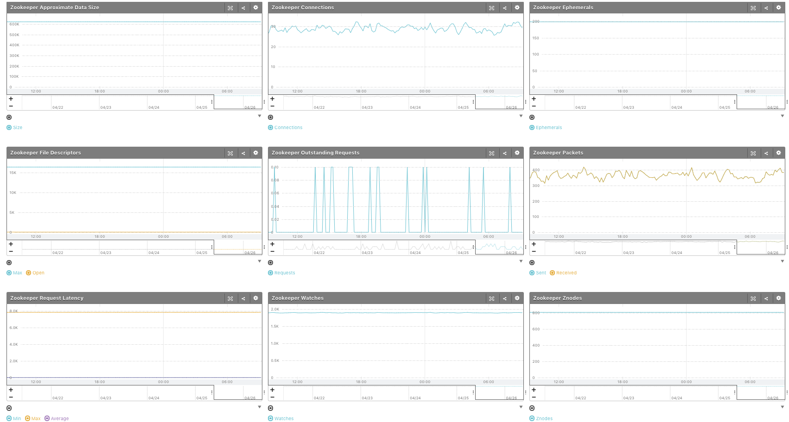

# mackerel-plugin-zookeeper [](https://travis-ci.org/y-kuno/mackerel-plugin-zookeeper)

Zookeeper plugin for mackerel.io agent. This repository releases an artifact to Github Releases, which satisfy the format for mkr plugin installer.

## Install

```shell
mkr plugin install y-kuno/mackerel-plugin-zookeeper
```

## Synopsis

```shell
mackerel-plugin-zookeeper [-host=<host>] [-port=<port>] [-metric-key-prefix=<prefix>]
```

## Example of mackerel-agent.conf

```
[plugin.metrics.zookeeper]
command = "/path/to/mackerel-plugin-zookeeper"
```

## Supported Versions

* `>= 3.4.0`

## Documents

* [ZooKeeper Commands](https://zookeeper.apache.org/doc/r3.4.11/zookeeperAdmin.html#sc_zkCommands)

## Screenshot


